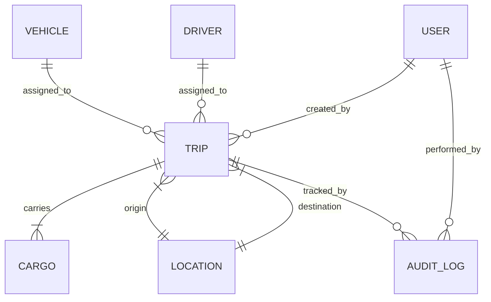

# Trip Dispatcher & Management System

## PART 2 — System & Technical Blueprint

---

## 1. Data Model

### Entity Relationship Diagram



### Vehicle Entity
```sql
CREATE TABLE vehicles (
    id              UUID PRIMARY KEY DEFAULT gen_random_uuid(),
    name            TEXT NOT NULL,
    type            TEXT NOT NULL CHECK (type IN ('Truck', 'Van', 'Car', 'Tanker')),
    license_plate   TEXT UNIQUE NOT NULL,
    max_capacity_kg NUMERIC(10,2) NOT NULL,
    fuel_level      NUMERIC(5,2) DEFAULT 100.0,
    fuel_range_km   NUMERIC(10,2) DEFAULT 500.0,
    status          TEXT NOT NULL DEFAULT 'Available'
                    CHECK (status IN ('Available','On Trip','In Shop','Reserved','Decommissioned')),
    region          TEXT DEFAULT 'Central',
    current_lat     DOUBLE PRECISION,
    current_lon     DOUBLE PRECISION,
    soft_lock_by    UUID REFERENCES users(id),
    soft_lock_expires TIMESTAMPTZ,
    last_service_date DATE,
    next_service_due  DATE,
    created_at      TIMESTAMPTZ DEFAULT NOW(),
    updated_at      TIMESTAMPTZ DEFAULT NOW()
);

CREATE INDEX idx_vehicles_status ON vehicles(status);
CREATE INDEX idx_vehicles_type ON vehicles(type);
CREATE INDEX idx_vehicles_region ON vehicles(region);
CREATE INDEX idx_vehicles_soft_lock ON vehicles(soft_lock_expires) WHERE soft_lock_expires IS NOT NULL;
```

### Driver Entity
```sql
CREATE TABLE drivers (
    id              UUID PRIMARY KEY DEFAULT gen_random_uuid(),
    name            TEXT NOT NULL,
    phone           TEXT,
    license_class   TEXT NOT NULL CHECK (license_class IN ('Light', 'Medium', 'Heavy', 'Hazmat')),
    status          TEXT NOT NULL DEFAULT 'Available'
                    CHECK (status IN ('Available','On Trip','Off Duty','Suspended','Reserved')),
    shift_start     TIME NOT NULL DEFAULT '08:00',
    shift_end       TIME NOT NULL DEFAULT '20:00',
    max_daily_hours NUMERIC(4,1) DEFAULT 10.0,
    hours_driven_today NUMERIC(4,1) DEFAULT 0.0,
    soft_lock_by    UUID REFERENCES users(id),
    soft_lock_expires TIMESTAMPTZ,
    created_at      TIMESTAMPTZ DEFAULT NOW(),
    updated_at      TIMESTAMPTZ DEFAULT NOW()
);

CREATE INDEX idx_drivers_status ON drivers(status);
CREATE INDEX idx_drivers_license ON drivers(license_class);
CREATE INDEX idx_drivers_soft_lock ON drivers(soft_lock_expires) WHERE soft_lock_expires IS NOT NULL;
```

### Trip Entity
```sql
CREATE TABLE trips (
    id              UUID PRIMARY KEY DEFAULT gen_random_uuid(),
    trip_number     SERIAL UNIQUE,
    status          TEXT NOT NULL DEFAULT 'Draft'
                    CHECK (status IN ('Draft','Dispatched','Completed','Cancelled')),
    vehicle_id      UUID NOT NULL REFERENCES vehicles(id),
    driver_id       UUID NOT NULL REFERENCES drivers(id),
    origin_id       UUID NOT NULL REFERENCES locations(id),
    destination_id  UUID NOT NULL REFERENCES locations(id),
    pickup_time     TIMESTAMPTZ NOT NULL,
    delivery_deadline TIMESTAMPTZ NOT NULL,
    actual_departure TIMESTAMPTZ,
    actual_arrival   TIMESTAMPTZ,
    estimated_distance_km NUMERIC(10,2),
    estimated_duration_min INT,
    cancellation_reason TEXT,
    replacement_for UUID REFERENCES trips(id),
    created_by      UUID NOT NULL REFERENCES users(id),
    dispatched_by   UUID REFERENCES users(id),
    dispatched_at   TIMESTAMPTZ,
    completed_at    TIMESTAMPTZ,
    cancelled_at    TIMESTAMPTZ,
    version         INT DEFAULT 1,  -- Optimistic locking
    created_at      TIMESTAMPTZ DEFAULT NOW(),
    updated_at      TIMESTAMPTZ DEFAULT NOW()
);

CREATE INDEX idx_trips_status ON trips(status);
CREATE INDEX idx_trips_vehicle ON trips(vehicle_id);
CREATE INDEX idx_trips_driver ON trips(driver_id);
CREATE INDEX idx_trips_pickup ON trips(pickup_time);
CREATE INDEX idx_trips_status_vehicle ON trips(status, vehicle_id)
    WHERE status IN ('Draft', 'Dispatched');
CREATE INDEX idx_trips_status_driver ON trips(status, driver_id)
    WHERE status IN ('Draft', 'Dispatched');
```

### Cargo Entity
```sql
CREATE TABLE cargo (
    id              UUID PRIMARY KEY DEFAULT gen_random_uuid(),
    trip_id         UUID NOT NULL REFERENCES trips(id) ON DELETE CASCADE,
    description     TEXT NOT NULL,
    cargo_type      TEXT NOT NULL CHECK (cargo_type IN (
                        'General','Electronics','Perishable','Hazmat',
                        'Construction','Medical','Documents','Industrial'
                    )),
    weight_kg       NUMERIC(10,2) NOT NULL CHECK (weight_kg > 0),
    actual_weight_kg NUMERIC(10,2),  -- Measured at pickup
    is_fragile      BOOLEAN DEFAULT FALSE,
    is_hazardous    BOOLEAN DEFAULT FALSE,
    status          TEXT DEFAULT 'Pending'
                    CHECK (status IN ('Pending','Loaded','In Transit','Delivered','Returned')),
    created_at      TIMESTAMPTZ DEFAULT NOW()
);

CREATE INDEX idx_cargo_trip ON cargo(trip_id);
CREATE INDEX idx_cargo_status ON cargo(status);
```

### Location Entity
```sql
CREATE TABLE locations (
    id          UUID PRIMARY KEY DEFAULT gen_random_uuid(),
    name        TEXT NOT NULL,
    address     TEXT,
    lat         DOUBLE PRECISION NOT NULL,
    lon         DOUBLE PRECISION NOT NULL,
    region      TEXT DEFAULT 'Central',
    type        TEXT CHECK (type IN ('Depot','Warehouse','Customer','Hub','Port')),
    created_at  TIMESTAMPTZ DEFAULT NOW()
);

CREATE INDEX idx_locations_region ON locations(region);
```

### Audit Log Entity
```sql
CREATE TABLE audit_logs (
    id          BIGSERIAL PRIMARY KEY,
    entity_type TEXT NOT NULL,       -- 'Trip', 'Vehicle', 'Driver'
    entity_id   UUID NOT NULL,
    action      TEXT NOT NULL,       -- 'CREATE', 'STATUS_CHANGE', 'ASSIGN', 'OVERRIDE'
    old_value   JSONB,
    new_value   JSONB,
    performed_by UUID REFERENCES users(id),
    reason      TEXT,
    ip_address  INET,
    created_at  TIMESTAMPTZ DEFAULT NOW()
);

CREATE INDEX idx_audit_entity ON audit_logs(entity_type, entity_id);
CREATE INDEX idx_audit_time ON audit_logs(created_at DESC);
CREATE INDEX idx_audit_action ON audit_logs(action);
```

### User Entity (RBAC)
```sql
CREATE TABLE users (
    id          UUID PRIMARY KEY DEFAULT gen_random_uuid(),
    username    TEXT UNIQUE NOT NULL,
    email       TEXT UNIQUE NOT NULL,
    role        TEXT NOT NULL CHECK (role IN ('Dispatcher', 'Supervisor', 'Admin', 'System')),
    is_active   BOOLEAN DEFAULT TRUE,
    created_at  TIMESTAMPTZ DEFAULT NOW()
);
```

### License-Vehicle Compatibility
```
Light    → Car
Medium   → Car, Van
Heavy    → Car, Van, Truck
Hazmat   → Car, Van, Truck, Tanker (with hazmat certification)
```

---

## 2. Validation Engine Design

### Architecture

```
┌─────────────────────────────────────────┐
│          VALIDATION ENGINE              │
│                                         │
│  ┌──────────┐  ┌──────────┐  ┌───────┐ │
│  │ Sync     │  │ Async    │  │ Rule  │ │
│  │ Validator│  │ Validator│  │ Store │ │
│  └────┬─────┘  └────┬─────┘  └───┬───┘ │
│       │              │            │     │
│  ┌────▼──────────────▼────────────▼───┐ │
│  │        Rule Evaluation Pipeline    │ │
│  │  1. Capacity → 2. Schedule →       │ │
│  │  3. Availability → 4. Time →       │ │
│  │  5. Compliance → 6. Route          │ │
│  └────────────────────────────────────┘ │
│                    │                    │
│         ┌──────────▼──────────┐         │
│         │  ValidationResult   │         │
│         │  - errors[]         │         │
│         │  - warnings[]       │         │
│         │  - info[]           │         │
│         │  - canProceed: bool │         │
│         └─────────────────────┘         │
└─────────────────────────────────────────┘
```

### Pluggable Rule Architecture
Each validation rule implements a common interface:

```javascript
// Rule Interface
class ValidationRule {
    constructor(id, tier, label) {
        this.id = id;          // e.g., 'V-001'
        this.tier = tier;      // 'error' | 'warning' | 'info'
        this.label = label;
    }

    // Returns { passed: boolean, message: string }
    async evaluate(tripData, context) {
        throw new Error('Must implement evaluate()');
    }
}

// Example: Capacity Rule
class CapacityRule extends ValidationRule {
    constructor() {
        super('V-001', 'error', 'Cargo Capacity Check');
    }

    async evaluate(tripData, context) {
        const vehicle = context.vehicle;
        const totalWeight = tripData.cargo.reduce((sum, c) => sum + c.weight_kg, 0);

        if (totalWeight > vehicle.max_capacity_kg) {
            return {
                passed: false,
                message: `Cargo (${totalWeight}kg) exceeds capacity (${vehicle.max_capacity_kg}kg) by ${totalWeight - vehicle.max_capacity_kg}kg`
            };
        }

        // Tier-2: Warning threshold at 85%
        if (totalWeight > vehicle.max_capacity_kg * 0.85) {
            return {
                passed: true,
                tier: 'warning',
                message: `Cargo at ${((totalWeight / vehicle.max_capacity_kg) * 100).toFixed(1)}% capacity`
            };
        }

        return { passed: true };
    }
}

// Example: Schedule Conflict Rule
class ScheduleConflictRule extends ValidationRule {
    constructor() {
        super('V-006', 'error', 'Schedule Conflict Check');
    }

    async evaluate(tripData, context) {
        const conflicts = await db.query(`
            SELECT id, trip_number, pickup_time, delivery_deadline
            FROM trips
            WHERE vehicle_id = $1
              AND status IN ('Draft', 'Dispatched')
              AND pickup_time < $3
              AND delivery_deadline > $2
              AND id != $4
        `, [tripData.vehicle_id, tripData.pickup_time,
            tripData.delivery_deadline, tripData.id || '00000000-0000-0000-0000-000000000000']);

        if (conflicts.length > 0) {
            return {
                passed: false,
                message: `Vehicle has conflicting trip #${conflicts[0].trip_number}`
            };
        }
        return { passed: true };
    }
}
```

### Validation Pipeline Execution
```javascript
class ValidationEngine {
    constructor() {
        this.rules = [
            new CapacityRule(),
            new ScheduleConflictRule(),
            new DriverAvailabilityRule(),
            new TimeFeasibilityRule(),
            new FuelSufficiencyRule(),
            new DriverShiftRule()
        ];
    }

    async validate(tripData) {
        const results = { errors: [], warnings: [], info: [], canProceed: true };

        for (const rule of this.rules) {
            const result = await rule.evaluate(tripData, await this.buildContext(tripData));

            if (!result.passed && rule.tier === 'error') {
                results.errors.push({ id: rule.id, label: rule.label, message: result.message });
                results.canProceed = false;
            } else if (result.tier === 'warning') {
                results.warnings.push({ id: rule.id, label: rule.label, message: result.message });
            } else if (result.tier === 'info') {
                results.info.push({ id: rule.id, label: rule.label, message: result.message });
            }
        }

        return results;
    }
}
```

---

## 3. API Architecture

### Endpoint Definitions

#### `POST /api/trips` — Create Trip Draft
```
Request:
{
    "vehicle_id": "uuid",
    "driver_id": "uuid",
    "origin_id": "uuid",
    "destination_id": "uuid",
    "pickup_time": "2026-02-21T10:00:00Z",
    "delivery_deadline": "2026-02-21T14:00:00Z",
    "cargo": [
        { "description": "Electronics", "cargo_type": "Electronics",
          "weight_kg": 3200, "is_fragile": true }
    ]
}

Response 201:
{ "id": "uuid", "trip_number": 1042, "status": "Draft", "validation": { ... } }

Response 422 (validation failed):
{ "errors": [{ "id": "V-001", "message": "Cargo exceeds capacity by 200kg" }] }
```

#### `GET /api/available-vehicles?pickup_time=...&delivery_deadline=...&min_capacity=...`
```
Response 200:
[
    {
        "id": "uuid", "name": "T1", "type": "Truck",
        "max_capacity_kg": 4000, "fuel_level": 85,
        "region": "East", "status": "Available",
        "is_soft_locked": false
    }
]
```

#### `GET /api/available-drivers?pickup_time=...&delivery_deadline=...&vehicle_type=...`
```
Response 200:
[
    {
        "id": "uuid", "name": "Rajesh K.",
        "license_class": "Heavy", "status": "Available",
        "shift_end": "20:00", "hours_remaining_today": 6.5,
        "is_soft_locked": false
    }
]
```

#### `PATCH /api/trips/{id}/status` — Transition Trip State
```
Request:
{ "status": "Dispatched", "version": 1 }

Response 200:
{ "id": "uuid", "status": "Dispatched", "version": 2 }

Response 409 (optimistic lock conflict):
{ "error": "Trip was modified by another user. Please refresh." }

Response 403 (unauthorized transition):
{ "error": "Only Supervisors can cancel dispatched trips" }
```

#### `POST /api/trips/{id}/validate` — Validate Without Saving
```
Response 200:
{
    "canProceed": true,
    "errors": [],
    "warnings": [{ "id": "W-001", "message": "Cargo at 87% capacity" }],
    "info": [{ "id": "I-001", "message": "New route for this driver" }]
}
```

#### `DELETE /api/trips/{id}` — Cancel Trip
```
Request:
{ "reason": "Customer cancelled order" }

Response 200:
{ "id": "uuid", "status": "Cancelled", "cancelled_at": "..." }
```

#### `POST /api/vehicles/{id}/soft-lock` — Reserve Vehicle
```
Request:
{ "ttl_seconds": 60 }

Response 200:
{ "locked_until": "2026-02-21T10:01:00Z" }

Response 409:
{ "error": "Vehicle is already reserved by another dispatcher" }
```

### Error Code Reference
| HTTP Code | Meaning | Use Case |
|-----------|---------|----------|
| 201 | Created | Trip draft created |
| 200 | OK | Successful read/update |
| 400 | Bad Request | Missing/malformed fields |
| 403 | Forbidden | Role violation (dispatcher cancelling dispatched trip) |
| 404 | Not Found | Trip/vehicle/driver doesn't exist |
| 409 | Conflict | Optimistic lock failure, soft-lock conflict, double booking |
| 422 | Unprocessable | Validation rules failed |
| 429 | Rate Limited | Too many requests |

### Idempotency
| Endpoint | Strategy |
|----------|----------|
| `POST /trips` | Client-generated `Idempotency-Key` header; server caches result for 24h |
| `PATCH /trips/{id}/status` | `version` field acts as idempotency guard |
| `POST /soft-lock` | Idempotent by nature (same dispatcher re-locking = extend TTL) |

---

## 4. Concurrency & Locking Strategy

### Double-Booking Prevention

**Layer 1: Soft Lock (UI-Level)**
```sql
-- When dispatcher selects a vehicle in the form
UPDATE vehicles
SET soft_lock_by = $dispatcher_id,
    soft_lock_expires = NOW() + INTERVAL '60 seconds'
WHERE id = $vehicle_id
  AND (soft_lock_expires IS NULL OR soft_lock_expires < NOW())
RETURNING id;

-- If 0 rows affected → vehicle is already soft-locked by another dispatcher
```

**Layer 2: Optimistic Locking (Application-Level)**
```sql
-- When creating/updating a trip
UPDATE trips
SET status = 'Dispatched', version = version + 1, updated_at = NOW()
WHERE id = $trip_id AND version = $expected_version;

-- If 0 rows affected → version mismatch → 409 Conflict
```

**Layer 3: Database Constraints (DB-Level)**
```sql
-- Prevent a vehicle from being on two active trips simultaneously
CREATE UNIQUE INDEX idx_one_active_trip_per_vehicle
ON trips(vehicle_id)
WHERE status IN ('Dispatched');

-- Prevent a driver from being on two active trips simultaneously
CREATE UNIQUE INDEX idx_one_active_trip_per_driver
ON trips(driver_id)
WHERE status IN ('Dispatched');
```

### Race Condition Scenarios
| Scenario | Prevention |
|----------|-----------|
| Two dispatchers assign same vehicle | Soft lock (60s TTL) + unique partial index |
| Dispatcher submits stale form | Optimistic locking via `version` field → 409 |
| Vehicle breaks down during assignment | Pre-dispatch validation re-checks status |
| Simultaneous status transitions | `SELECT ... FOR UPDATE` on trip row in transaction |

### Locking Decision Matrix
| Operation | Lock Type | Reason |
|-----------|-----------|--------|
| Browse available vehicles | None | Read-only, eventual consistency OK |
| Select vehicle in form | Soft lock (60s) | Prevent other dispatchers from selecting |
| Create trip draft | Optimistic lock | Low contention, fast feedback |
| Dispatch trip | Pessimistic lock (`FOR UPDATE`) | Critical section, must be consistent |
| Cancel dispatched trip | Pessimistic lock (`FOR UPDATE`) | Status change must be atomic |

---

## 5. Database Schema — Optimization

### Indexing Strategy
| Index | Purpose | Query Pattern |
|-------|---------|---------------|
| `idx_trips_status` | Filter trips by lifecycle state | Dashboard views, reports |
| `idx_trips_status_vehicle` | Check vehicle schedule conflicts | Partial index on active trips only |
| `idx_trips_status_driver` | Check driver schedule conflicts | Partial index on active trips only |
| `idx_trips_pickup` | Time-range queries | Scheduling, timeline views |
| `idx_vehicles_status` | Filter available vehicles | Trip creation form |
| `idx_audit_entity` | Entity-specific audit history | Trip detail view |
| `idx_audit_time` | Recent audit entries | Supervisor review panel |

### Capacity Query Optimization
For the "available vehicles" query with cargo weight filter:
```sql
-- Optimized: Uses status index + capacity filter
SELECT v.*
FROM vehicles v
WHERE v.status = 'Available'
  AND v.max_capacity_kg >= $required_weight
  AND (v.soft_lock_expires IS NULL OR v.soft_lock_expires < NOW())
  AND NOT EXISTS (
      SELECT 1 FROM trips t
      WHERE t.vehicle_id = v.id
        AND t.status IN ('Draft', 'Dispatched')
        AND t.pickup_time < $delivery_deadline
        AND t.delivery_deadline > $pickup_time
  )
ORDER BY v.max_capacity_kg ASC;  -- Best-fit: smallest capable vehicle first
```

### Soft Lock Cleanup
```sql
-- Cron job every 30 seconds: Clear expired soft locks
UPDATE vehicles
SET soft_lock_by = NULL, soft_lock_expires = NULL
WHERE soft_lock_expires IS NOT NULL AND soft_lock_expires < NOW();

UPDATE drivers
SET soft_lock_by = NULL, soft_lock_expires = NULL
WHERE soft_lock_expires IS NOT NULL AND soft_lock_expires < NOW();
```

---

## 6. Event Logging & Audit

### Audit Trail Architecture
Every state change creates an immutable record:

```javascript
async function logAudit(entityType, entityId, action, oldValue, newValue, userId, reason) {
    await db.query(`
        INSERT INTO audit_logs (entity_type, entity_id, action, old_value, new_value, performed_by, reason)
        VALUES ($1, $2, $3, $4, $5, $6, $7)
    `, [entityType, entityId, action,
        JSON.stringify(oldValue), JSON.stringify(newValue),
        userId, reason]);
}

// Usage in trip dispatch:
await logAudit('Trip', tripId, 'STATUS_CHANGE',
    { status: 'Draft' },
    { status: 'Dispatched', dispatched_at: new Date() },
    dispatcherId,
    null
);
```

### Event Types Logged
| Event | Entity | Fields Captured |
|-------|--------|----------------|
| Trip Created | Trip | All fields, created_by |
| Trip Dispatched | Trip | status change, dispatched_by, timestamp |
| Trip Completed | Trip | status change, actual_arrival, completed_at |
| Trip Cancelled | Trip | status change, reason, cancelled_by |
| Vehicle Assigned | Vehicle | status → On Trip, trip_id |
| Vehicle Released | Vehicle | status → Available, previous trip_id |
| Driver Assigned | Driver | status → On Trip, trip_id |
| Warning Override | Trip | warning IDs, override reason, supervisor_id |
| Soft Lock Created | Vehicle/Driver | locked_by, expires_at |
| Validation Failed | Trip | error details, attempted values |

### Rollback Strategy
Audit logs are **append-only** and **immutable**. To "undo" an action:
1. Read the audit log entry's `old_value`
2. Create a new entry with action = `ROLLBACK`
3. Apply the `old_value` as the current state
4. This creates a full forward-only audit chain

---

## 7. Scalability Strategy

### Architecture Tiers

```
┌─────────────┐     ┌──────────────┐     ┌──────────────┐
│   Frontend   │────→│  API Gateway  │────→│  Trip Service│
│  (React/HTML)│     │  (Rate Limit) │     │  (Node.js)   │
└─────────────┘     └──────────────┘     └──────┬───────┘
                                                │
                    ┌───────────────┬────────────┼────────────┐
                    │               │            │            │
               ┌────▼────┐   ┌─────▼─────┐ ┌───▼────┐ ┌─────▼─────┐
               │Validation│   │ Audit     │ │ Supabase│ │ Message   │
               │ Engine   │   │ Service   │ │ (PG)   │ │ Queue     │
               └──────────┘   └───────────┘ └────────┘ └───────────┘
```

### Horizontal Scaling Approach
| Component | Scaling Strategy |
|-----------|-----------------|
| **API Layer** | Stateless Node.js → horizontal pod autoscaling behind load balancer |
| **Database** | Supabase (managed Postgres) with read replicas for dashboard queries |
| **Validation Engine** | Stateless — scales with API layer |
| **Audit Logging** | Async write to message queue → batch insert worker |
| **Soft Lock Cleanup** | Single cron worker, idempotent |

### Modular Monolith → Microservices Path
**Phase 1 (Current):** Modular monolith in Node.js
- Single `server.js` with clear module boundaries
- Shared database (Supabase)
- Fastest to develop and deploy

**Phase 2 (Growth):** Extract services
- Trip Service, Vehicle Service, Driver Service, Audit Service
- Event bus (Redis Pub/Sub or NATS) for inter-service communication
- Separate databases per service

### Background Jobs
| Job | Frequency | Purpose |
|-----|-----------|---------|
| Soft lock cleanup | Every 30s | Release expired reservations |
| Draft expiration | Every 5 min | Auto-cancel drafts older than 24h |
| Driver hours reset | Daily at midnight | Reset `hours_driven_today` |
| Telemetry archival | Hourly | Move old telemetry to cold storage |

---

## 8. Security & Access Control

### RBAC Matrix
| Resource | Dispatcher | Supervisor | Admin |
|----------|-----------|------------|-------|
| Create trip | ✅ | ✅ | ✅ |
| Dispatch trip | ✅ | ✅ | ✅ |
| Cancel draft | ✅ (own) | ✅ (any) | ✅ (any) |
| Cancel dispatched | ❌ | ✅ | ✅ |
| Override warnings | ❌ | ✅ | ✅ |
| View audit logs | ❌ | ✅ | ✅ |
| Manage users | ❌ | ❌ | ✅ |
| Delete records | ❌ | ❌ | ✅ |

### API Security
| Measure | Implementation |
|---------|----------------|
| **Authentication** | Supabase Auth (JWT tokens) |
| **Authorization** | Middleware checks `user.role` against endpoint permissions |
| **Rate Limiting** | 100 req/min per user, 20 req/min for write operations |
| **Input Validation** | Zod/Joi schemas on every endpoint input |
| **SQL Injection** | Parameterized queries only |
| **Sensitive Logging** | No PII in logs, audit logs encrypted at rest |

### Sensitive Operation Logging
These actions are flagged in audit logs with elevated visibility:
- Warning overrides by supervisor
- Dispatched trip cancellation
- Manual trip completion without GPS confirmation
- Any action by Admin role
- Failed login attempts

### API Rate Limiting Tiers
| Role | Read Limit | Write Limit | Burst |
|------|-----------|-------------|-------|
| Dispatcher | 200/min | 30/min | 50 |
| Supervisor | 300/min | 50/min | 80 |
| Admin | 500/min | 100/min | 150 |
| System/Bot | 1000/min | 200/min | 300 |
